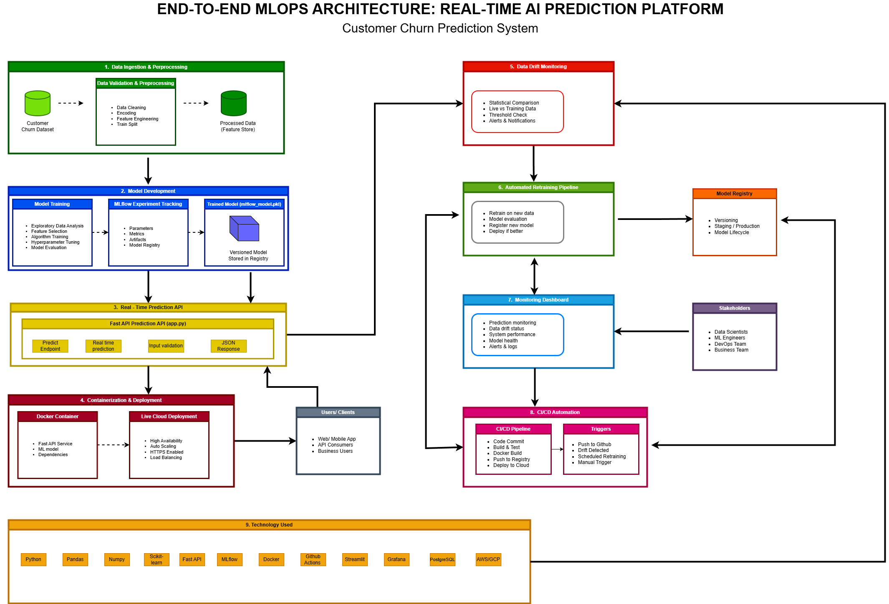
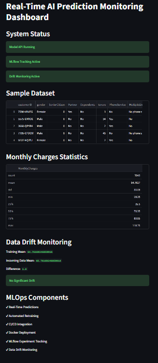
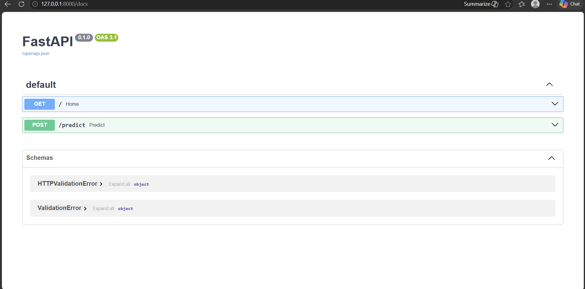
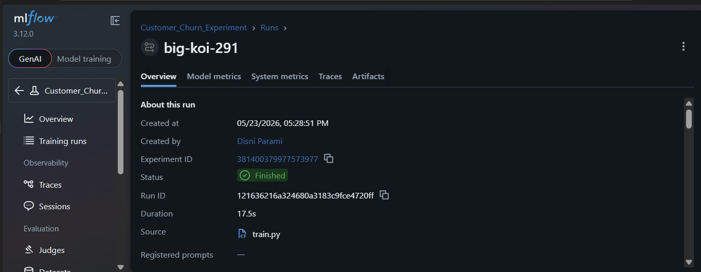
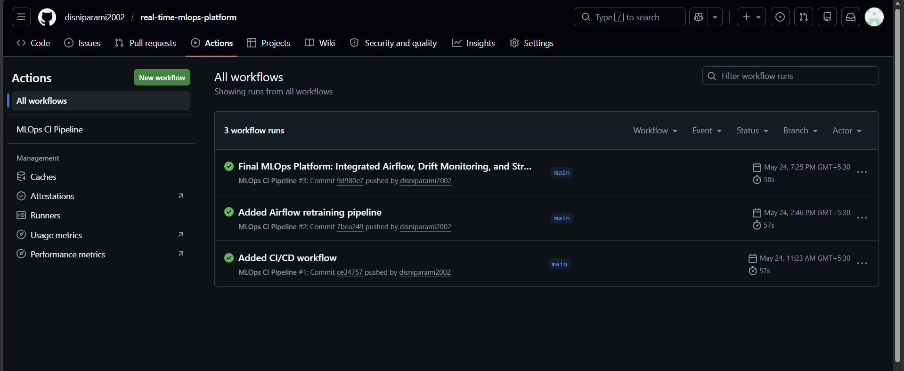
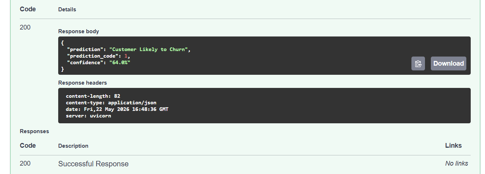

# Real-Time AI Prediction Platform with Automated MLOps Pipeline

## 1. Project Overview

This project implements a production-grade Real-Time AI Prediction Platform with an automated MLOps pipeline for customer churn prediction.

The platform demonstrates enterprise-grade AI system deployment, monitoring, retraining, and lifecycle management using modern MLOps practices.

The system supports:

- Real-time predictions
- Automated retraining
- MLflow experiment tracking
- Data drift monitoring
- CI/CD automation
- Cloud deployment
- Monitoring dashboard visualization

---

## 2. Objectives

The main objective of this project is to build an end-to-end MLOps platform capable of:

- Real-time AI predictions
- Continuous model monitoring
- Automated retraining pipelines
- Experiment tracking
- Cloud deployment
- CI/CD integration
- Drift monitoring and automated updates

---

## 3. Technologies Used

- Python
- Pandas
- NumPy
- Scikit-Learn
- FastAPI
- MLflow
- Docker
- GitHub Actions
- Streamlit
- Apache Airflow

---

## 3.1 Repository Structure

Main project directories:

- api/ → FastAPI prediction API
- dashboard/ → Streamlit monitoring dashboard
- src/ → Model training and drift monitoring scripts
- airflow/dags/ → Automated retraining pipeline
- models/ → Trained ML model
- images/ → Project screenshots and architecture diagram
- docs/ → Technical documentation and final report

---

## 4. System Architecture



---

## 5. Dataset Description

The project uses the Telco Customer Churn dataset.

Dataset includes:

- Customer demographics
- Subscription information
- Service details
- Billing information
- Churn labels

### Target Variable

- Churn

---

## 6. Data Preprocessing

The preprocessing stage includes:

- Handling missing values
- Encoding categorical variables
- Feature selection
- Train-test split
- Data transformation

### Libraries Used

- Pandas
- Scikit-Learn

---

## 7. Model Training

The machine learning model was trained using Scikit-Learn.

### Training Pipeline Includes

- Data loading
- Feature preprocessing
- Model training
- Accuracy evaluation
- Model serialization

### Model File Generated

- churn_model.pkl

### Training Script

- src/train.py

---

## 8. MLflow Experiment Tracking

MLflow was integrated for experiment tracking.

### Tracked Information

- Accuracy metrics
- Parameters
- Model artifacts
- Training runs

MLflow UI was used to monitor experiments and compare model performance.

### MLflow UI Command

```bash
mlflow ui --workers 1
```

### MLflow Local URL

```bash
http://127.0.0.1:5000
```

---

## 9. FastAPI Real-Time Prediction API

FastAPI was used to create a real-time prediction API.

### Features

- REST API endpoint
- JSON input support
- Real-time prediction generation
- Swagger UI documentation

### API Endpoint

```bash
POST /predict
```

### Swagger UI URL

```bash
http://127.0.0.1:8000/docs
```

### API File

- api/app.py

---

## 10. Docker Containerization

The application was containerized using Docker.

### Docker Setup Includes

- FastAPI application
- Python dependencies
- Model files
- API runtime environment

Docker enables consistent deployment across environments.

### Docker Commands

#### Build Docker Image

```bash
docker build -t churn-api .
```

#### Run Docker Container

```bash
docker run -p 8000:8000 churn-api
```

---

## 11. CI/CD Pipeline using GitHub Actions

GitHub Actions was integrated for CI/CD automation.

### Pipeline Tasks

- Automated repository build
- Dependency installation
- Continuous integration workflow
- Deployment preparation

### Workflow File

- .github/workflows/ci.yml

---

## 12. Data Drift Monitoring

Data drift monitoring was implemented to compare incoming data with training data.

### Monitoring Includes

- Statistical comparison
- Drift detection
- Drift metrics visualization

### Drift Monitoring Script

- src/drift_monitor.py

---

## 13. Automated Retraining Pipeline

An automated retraining pipeline was designed using Apache Airflow.

### Pipeline Tasks

- Trigger retraining
- Execute train.py
- Update trained model
- Schedule retraining jobs

### Pipeline File

- airflow/dags/retrain_pipeline.py

---

## 14. Monitoring Dashboard

A Streamlit dashboard was developed for monitoring the system.

### Dashboard Features

- System status monitoring
- Drift monitoring
- Dataset visualization
- Model statistics
- Monitoring metrics

### Dashboard File

- dashboard/dashboard.py

---

## 15. Cloud Deployment

The monitoring dashboard was deployed using Streamlit Community Cloud.

### Live Deployment URL

https://real-time-mlops-platform-eeywujbeavtjvqb69sfwrd.streamlit.app/

---

## 15.1 Live System Access

The deployed Streamlit monitoring dashboard provides public access to the monitoring environment.

Users can:

- Monitor system status
- View drift monitoring results
- Inspect dataset statistics
- Verify deployment status

### Deployment Platform

- Streamlit Community Cloud

---

## 16. Testing & Validation

The system was tested using:

- Swagger UI
- Browser testing
- API endpoint testing
- Streamlit dashboard validation

Prediction API successfully generated real-time predictions.

---

## 17. Challenges Faced

Challenges encountered during development:

- Airflow compatibility issues on Windows
- Dependency management
- Docker environment setup
- MLflow configuration issues
- Deployment optimization for free cloud resources

---

## 18. Future Improvements

Possible future enhancements:

- Kubernetes deployment
- Advanced drift detection
- Automated model rollback
- Real-time streaming integration
- Database integration
- User authentication
- Advanced monitoring dashboards

---

## 18.1 Project Screenshots

### Streamlit Monitoring Dashboard



---

### Swagger API Testing



---

### MLflow Experiment Tracking



---

### GitHub Actions CI/CD



---

### Prediction Result



---

## 19. Conclusion

This project successfully demonstrates a complete end-to-end MLOps workflow for a real-time AI prediction platform.

The system integrates:

- Machine learning
- API deployment
- Experiment tracking
- Drift monitoring
- Automated retraining
- CI/CD automation
- Cloud deployment

The platform simulates how enterprise AI systems are developed, monitored, and maintained in real-world production environments.

---

## GitHub Repository

https://github.com/disniparami2002/real-time-mlops-platform